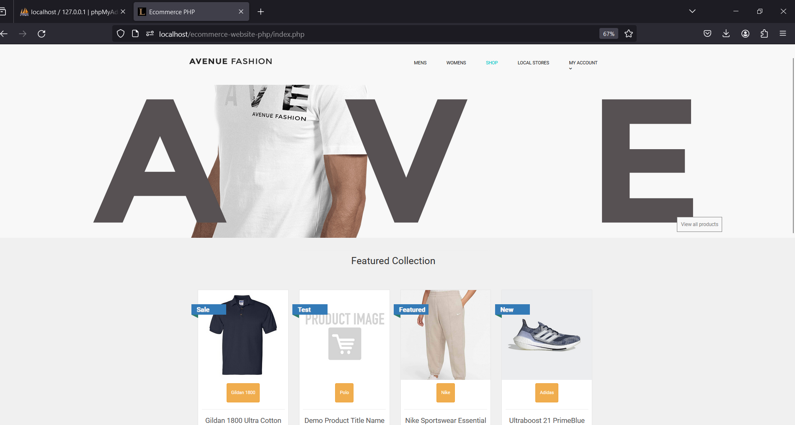
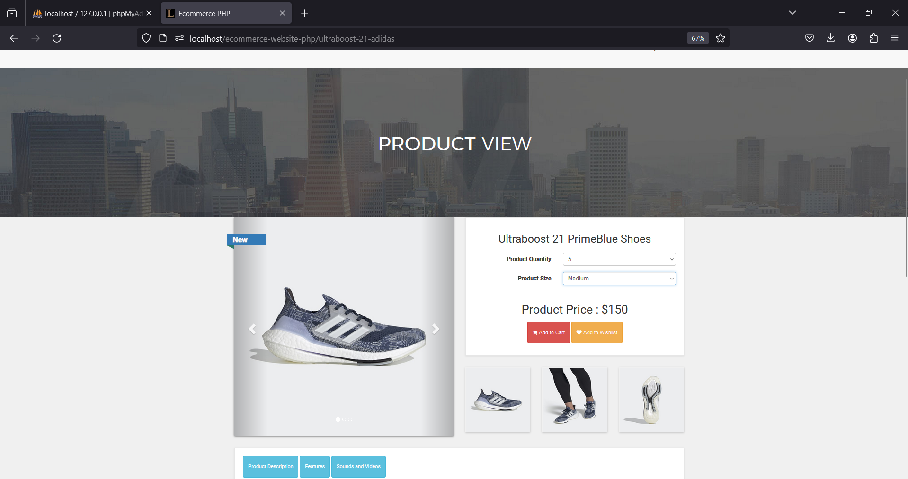
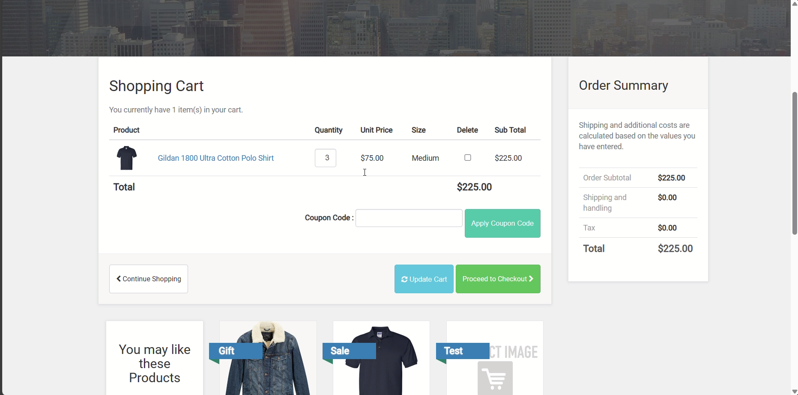

# E-commerce Store Project

This E-commerce store project, developed using **PHP** and **MySQL**, provides a full-featured online shopping platform. The system includes essential e-commerce functionalities such as product browsing, shopping cart, payment integration, and user account management. Additionally, an admin panel offers control over inventory, orders, and users, along with detailed sales reports.

## Features

### User Side
- **Product Browsing**: Users can browse products by category, view detailed descriptions, and filter by price, rating, etc.
- **Shopping Cart**: Users can add products to the cart, update quantities, and view the total cost before proceeding to checkout.
- **Secure Payment Integration**: Supports multiple payment gateways for seamless transactions.
- **User Account Management**: Users can register, log in, and manage their orders and profile information.

### Admin Side
- **Inventory Management**: Admins can add, update, and delete products, manage stock levels, and categorize items.
- **Order Management**: View, process, and update customer orders.
- **User Management**: Control user accounts, view activity logs, and manage user roles.
- **Sales Reports**: Generate and view reports on sales, revenue, and product performance.

## Technologies Used

- **Front-end**: HTML, CSS, JavaScript
- **Back-end**: PHP
- **Database**: MySQL
- **Payment Gateway**: [Specify the payment gateway used, e.g., PayPal, Stripe]

## Prerequisites

- **XAMPP/WAMP**: To run the PHP server locally.
- **MySQL**: To manage the database.

## Installation

### Setting up with XAMPP

1. **Install XAMPP**:
   - Download XAMPP from the [official website](https://www.apachefriends.org/index.html).
   - Install XAMPP following the installation wizard instructions.

2. **Start XAMPP**:
   - Open the XAMPP Control Panel.
   - Start the Apache and MySQL modules by clicking the "Start" button next to each.

3. **Clone the repository**:
   - Open a terminal or command prompt.
   - Navigate to the `htdocs` folder in your XAMPP installation directory:
     ```bash
     cd C:\xampp\htdocs
     ```
   - Clone the repository:
     ```bash
     git clone https://github.com/parthsshetty04/eCommerce-Store.git
     ```

4. **Set up the database**:
   - Open your web browser and go to `http://localhost/phpmyadmin`.
   - Click on "New" in the left sidebar to create a new database.
   - Name the database `ecommerce` and click "Create".
   - Select the `ecommerce` database from the left sidebar.
   - Click on the "Import" tab in the top menu.
   - Click "Choose File" and select the `ecommerce.sql` file from your cloned project folder.
   - Click "Go" at the bottom of the page to import the database structure and data.

5. **Configure database connection**:
   - Navigate to the project folder:
     ```bash
     cd C:\xampp\htdocs\eCommerce-Store
     ```
   - Open the `config.php` file in a text editor.
   - Update the database credentials if necessary (the default XAMPP settings should work):
     ```php
     <?php
     $conn = mysqli_connect("localhost", "root", "", "ecommerce");
     if (!$conn) {
         die("Connection failed: " . mysqli_connect_error());
     }
     ?>
     ```

6. **Access the project**:
   - Open your web browser and go to `http://localhost/eCommerce-Store`.
   - You should now see the homepage of your e-commerce store.

7. **Admin Login**:
   - To access the admin panel, go to `http://localhost/eCommerce-Store/admin` (adjust the URL if your admin panel is located elsewhere).
   - Use the following default credentials:
     - Username: admin
     - Password: admin123
   - It's highly recommended to change these credentials after your first login.

### Troubleshooting

- If you encounter a "404 Not Found" error, make sure your project folder is directly under the `htdocs` directory and that you've typed the URL correctly.
- If you see database connection errors, double-check your `config.php` file and ensure that the database name, username, and password match your XAMPP MySQL settings.
- For "500 Internal Server Error", check the Apache error logs in `C:\xampp\apache\logs\error.log` for more detailed error information.

## Usage

### User Side
- Users can register and log in to start shopping.
- Browse products, add them to the cart, and proceed to checkout.
- Make payments using the available payment gateways.
- View and manage their order history and profile information.

### Admin Side
- Admins can log in to the admin panel to manage product inventory, orders, and user accounts.
- Generate sales reports, view site activity, and monitor performance.

## Screenshot






## Future Enhancements

- Product Reviews: Allow users to leave reviews for products.
- Discount Codes: Integrate a coupon system for discounts.
- Order Notifications: Notify users via email upon order confirmation and shipping.
- Multi-language Support: Add support for multiple languages to reach a broader audience.

## Contributing

Contributions are welcome! If you'd like to contribute to the project:

1. Fork the repository.
2. Create a new branch for your feature or bug fix:
   ```bash
   git checkout -b feature-name
   ```
3. Make your changes and commit them:
   ```bash
   git commit -m "Added new feature"
   ```
4. Push your changes to your fork:
   ```bash
   git push origin feature-name
   ```
5. Open a pull request to merge your changes.

## License

This project is licensed under the MIT License. See the [LICENSE](LICENSE) file for more information.
